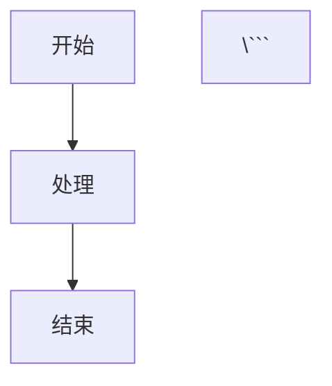

# 文章编写指南

本指南介绍如何在 Mizuki 内容仓库中编写和发布文章。

## 📝 创建新文章

### 方法 1: 手动创建

在 `posts/` 目录创建新的 `.md` 文件：

```bash
cd posts/
touch my-new-post.md
```

### 方法 2: 使用脚本 (如果路径在代码仓库下)

在代码仓库中执行：

```bash
pnpm run new-post
```

## 📋 文章结构

每篇文章包含两部分：

1. **Frontmatter** (文章元数据，YAML 格式)
2. **正文** (Markdown 格式)

### 基础模板

```markdown
---
title: 文章标题
published: 2024-01-01
description: 文章的简短描述，用于 SEO 和文章预览
image: /images/posts/cover.jpg
tags: [标签1, 标签2, 标签3]
category: 技术
draft: false
---

这里是文章的正文内容...

## 二级标题

内容...

### 三级标题

内容...
```

## 🏷️ Frontmatter 字段说明

### 必填字段

| 字段 | 类型 | 说明 | 示例 |
|------|------|------|------|
| `title` | String | 文章标题 | `"我的第一篇文章"` |
| `published` | Date | 发布日期 | `2024-01-01` |
| `description` | String | 文章描述 (150 字以内) | `"这是一篇关于..."` |

### 可选字段

| 字段 | 类型 | 说明 | 示例 |
|------|------|------|------|
| `image` | String | 封面图片路径 | `/images/posts/my-cover.jpg` |
| `tags` | Array | 标签列表 | `[技术, TypeScript, 前端]` |
| `category` | String | 分类 | `技术` / `生活` / `随笔` |
| `draft` | Boolean | 是否草稿 | `true` / `false` (默认 `false`) |
| `lang` | String | 语言 | `zh-cn` / `en` / `ja` (默认 `zh-cn`) |
| `password` | String | 加密密码 | `"my-secret-password"` |

### 高级字段

| 字段 | 类型 | 说明 |
|------|------|------|
| `updated` | Date | 更新日期 |
| `author` | String | 作者名称 |
| `keywords` | Array | SEO 关键词 |
| `toc` | Boolean | 是否显示目录 |

## 🖼️ 图片管理

### 图片存放位置

```
images/
├── posts/          # 文章配图
│   └── 2024/      # 按年份组织 (可选)
├── albums/         # 相册图片
└── diary/          # 日记图片
```

### 图片引用

**文章配图**:
```markdown

```

**封面图片** (Frontmatter):
```yaml
image: /images/posts/cover.jpg
```

### 图片优化建议

1. **格式**: 推荐使用 WebP (更小)
2. **尺寸**: 
   - 封面图: 1200x630px
   - 文章配图: 宽度 800-1200px
3. **压缩**: 使用工具压缩 (TinyPNG, Squoosh 等)
4. **大小**: 单张图片尽量 < 500KB

## 🔒 加密文章

需要密码才能查看的文章：

```yaml
---
title: 私密文章
published: 2024-01-01
description: 这是一篇加密文章
password: "my-secret-password"
---

只有输入正确密码才能看到的内容...
```

## 📝 草稿文章

未完成的文章标记为草稿：

```yaml
---
title: 未完成的文章
published: 2024-01-01
description: 这还在编写中
draft: true
---

内容还在完善中...
```

草稿文章不会在生产环境显示。

## 📂 文章分类

### 使用子目录

可以用子目录组织文章：

```
posts/
├── guide/          # 指南类
│   └── markdown-tutorial.md
├── tech/           # 技术类
│   └── typescript-tips.md
└── life/           # 生活类
    └── my-diary.md
```

## 🏷️ 标签使用

### 标签命名建议

- 使用简洁的关键词
- 保持一致性 (例如统一使用 `TypeScript` 而不是 `typescript` 或 `TS`)
- 不要过多 (3-5 个为宜)

### 示例

```yaml
tags: [TypeScript, React, 前端开发]
```

## 📅 发布流程

### 1. 编写文章

创建文件并编写内容。

### 2. 预览 (本地)

如果本地运行代码仓库：

```bash
pnpm dev
```

访问 `http://localhost:4321` 预览。

### 3. 提交

```bash
git add posts/my-new-post.md
git commit -m "post: 添加新文章《文章标题》"
```

### 4. 推送

```bash
git push
```

### 5. 自动部署

如果配置了自动构建触发器，推送后会自动重新部署站点。

查看配置: [../.github/workflows/README.md](../.github/workflows/README.md)

## 🎨 高级功能

### Mermaid 图表

```markdown


### 数学公式 (LaTeX)

行内公式: `$E = mc^2$`

块级公式:
```markdown
$$
\int_{a}^{b} f(x) dx
$$
```

### 提示框

```markdown
:::tip
这是一个提示
:::

:::warning
这是一个警告
:::

:::danger
这是一个危险提示
:::
```

### 视频嵌入

参考示例文章: `posts/video.md`

## 📚 示例文章

内容仓库提供了多个示例文章：

- `posts/markdown-tutorial.md` - Markdown 基础教程
- `posts/markdown-extended.md` - 扩展语法示例
- `posts/markdown-mermaid.md` - Mermaid 图表示例
- `posts/encrypted-post.md` - 加密文章示例
- `posts/video.md` - 视频嵌入示例
- `posts/draft.md` - 草稿示例

## 🔗 相关资源

- [Markdown 官方指南](https://www.markdownguide.org/)
- [Mermaid 图表文档](https://mermaid.js.org/)
- [WebP 转换工具](https://squoosh.app/)
- [图片压缩工具](https://tinypng.com/)

## 🤝 需要帮助？

- 查看 [主仓库文档](https://github.com/matsuzaka-yuki/Mizuki)
- 参考示例文章
- 提交 [Issue](https://github.com/matsuzaka-yuki/Mizuki/issues)

---

**Happy Writing!** ✨
